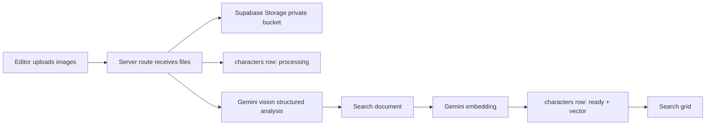
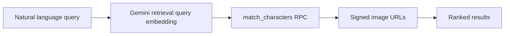

# Technical Architecture

## Stack

- Next.js app for UI and server API routes.
- Supabase Postgres for metadata.
- Supabase Storage for private images.
- Supabase `pgvector` for semantic search.
- Gemini for image analysis and text embeddings.

## Authentication

- Authentication is disabled for now so anyone with the internal link can use the app.
- The browser only calls Next.js API routes.
- The service-role key stays server-only.
- Supabase RLS policies remain in the migration history for a later authenticated mode, but the current server API uses the service role for database and storage work.

## Upload Pipeline

## Search Pipeline

If Gemini is unavailable, uploaded records use fallback metadata and text search. Supabase is required for the authenticated internal app.

## Supabase Tables

- `clients`: centrally maintained client list for a future assignment workflow.
- `characters`: image record, optional client, generated JSON profile, search document, vector embedding, processing state.
- `processing_events`: audit trail for upload and AI processing.

## Private Assets

Images are stored in a private Supabase bucket. API responses return signed URLs so the frontend can display images without exposing bucket write access.
